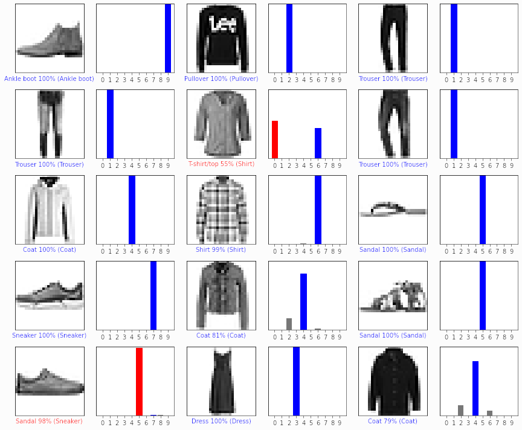

# Bachelor Thesis

## Pre Tasks

*In the following I am describing my finding and the path of solving the tasks*

Concerning Task 1 & 3 I am a little disappointed from the results I am getting.  
The pipeline I used to transform the .ply files to an .obj mesh was the follwing:
1. Downsample the data (optional step - if the following steps took to long)
2. extract primitives (planar segments) using RANSAC (I used Mapple which is the software mentioned at the github page of PolyFit)
3. using PolyFit to generate the mesh (trying out multiple parameters to achive the best result)

The biggest problem I encountered was the time PolyFit took for optimization.  
The computation time is strictly related to the amount of vertecies, the amount of primitves detected and the paramters (more bigger complexity parameter leads to dramatically increased computation time).  
While I had all these parameters under control, lowering vertecies and the amount of primitives also lowered the output quality because relevant planes where missing.  
As I wanted good results I sometimes had my computer running over night but optimization was still running after 8 hours.  
The other problem occured in the object-1 from task-1 and the point cloud from task-3. Both models are not closed on all sides.  
As the algorithm has no understanding of inside and outside completly missing planar segments lead to missing volume in the resulting mesh.  
In task-3 the algorithm acutally detected the correct walls but had the footway filled as a mesh.
Without understanding inside and outside the decision is logical, because the footway had a floor, so there was at least a planar segment on the ground.  
On the other hand the result of "object-2" are promising but the data includes all sides. In reality at least the ground under a building can not be scanned via any device so additional information would be necassary anyways.  
I'm not sure how they achieved the results of "object-1" in the paper because the input that is provided has the roof missing, so the 1nd floor is completly missing.  

### Task 1

I started by PolyFit compiling the newest version of PolyFit via Visual Studio as I couldn't find a pre build version for 1.4 on the releases page.  
I overread the notice about using Mapple for converting to .vg (Voxel Grid) files, which is the file extension PolyFit uses to import the Point Clouds.  
As I didnt find any information about that file type in the internet, I started digging into the source code and and build my own ply to vb converter ("ply-to-vb.ipynb"). But as PolyFit expects the input also to be segmented in the planes, I looked again on to the website and found the mentioning of Mapple for converting and segmenting the pount cloud. I then read about RANSAC to improve improve the segmentation I was doing. After that I achieved a really good estimation of "object-2".  
But as I depicted above the rest didnt went so well, but I added the results of the sample point clouds anyways. ("object-1", "object-3", "object-4", "object-5")   

### Task 2

I didn't spend much time on this task cause I actually just followed the [tutorial](https://www.tensorflow.org/tutorials/keras/classification) from the Tensorflow page and I was more curious about task 1 and 3 because I had no direct idea how to solve them exactly (which is a motivator for me).
The resulting juptyer notebook is under "task-2/fashion-mnist.ipynb". The notebook requires tensorflow, numpy and matplotlib to be installed.

### Task 3

For Task 3 I used the pipeline described above bout went with matlab to open the file, because I was capable of handling that much data.  
I then went ahead and tried 10%, 1% and 0.1% of the original amount of data using resampling. Only 0.1% of the original data was working, while 10% and 1% showed no results after multiple hours of optimization via PolyFit. I then added estimated normals to the vertecies using MatLab and exported it to Mapple. Then I extracted and planar segments and move the file to PolyFit.  
The following image shows the result I achieved while testing out many parameters. To the defense only 0.1% of the original data is used but I dont think more data would yield a better understanding of inside and outside for the algorithm. I also didnt try to cut out the vertecies from the trees because they do not create relevant planar segments and removing them is also probably not improving the result. But atleast that step would maybe lowered computational time. From my perspective additional steps have to be performed to help the existing algorithm to create correct representations of the point cloud.
